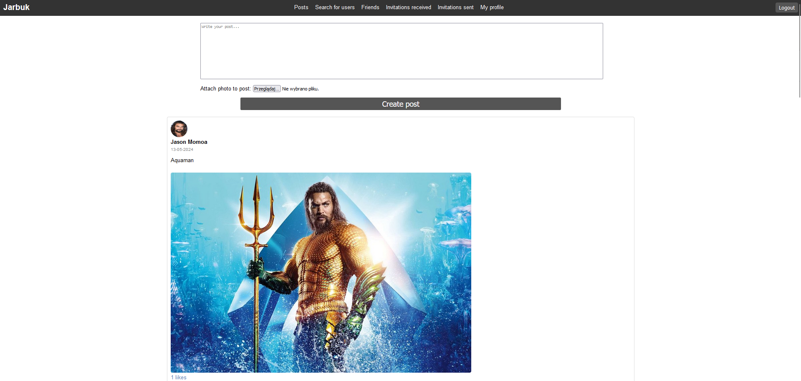
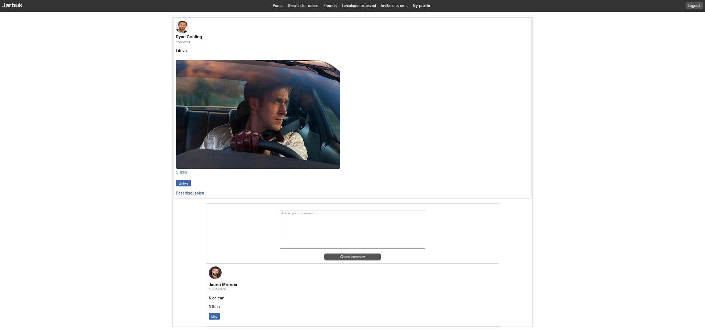
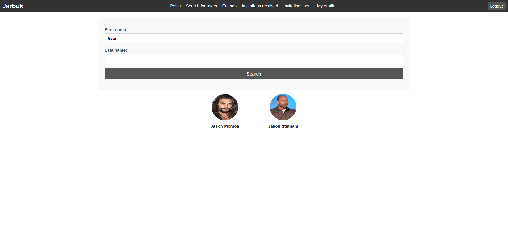
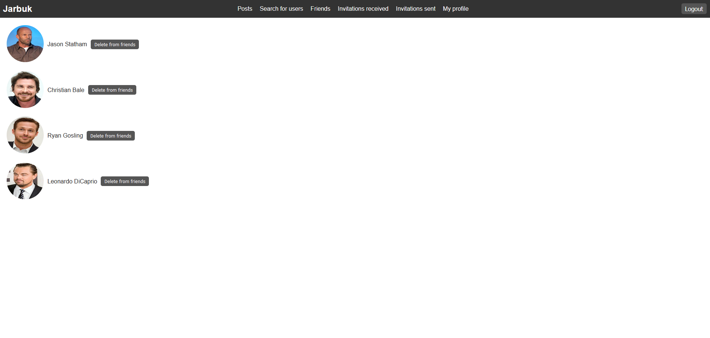
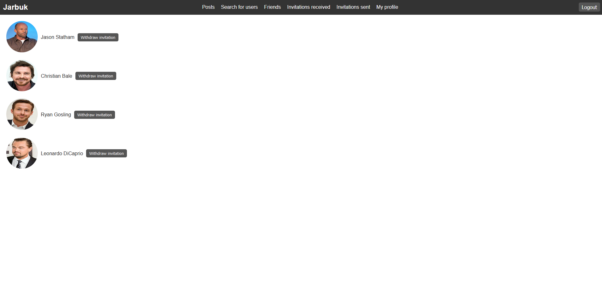
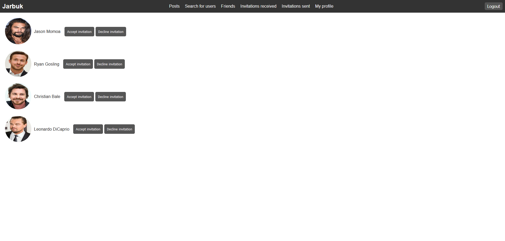

# Jarbuk
Jarbuk is a web application that I made to learn Django framework. It is a social media website that allows users to make new posts and comment them. Users can also invite each other to friends and like posts and comments. This project was made only for learning purposes with no intention of using it in production, that's why django secret key is visible in settings. If anyone would like to use this project, remember to change django secret key first.

# Tech used
Apart from Django framework I used javascript for doing AJAX requests and CSS for styling.

# Installation and usage
After cloning repository [create new python venv](https://docs.python.org/3/library/venv.html) and activate it. Next run run this command to install all needed libraries:
```bash
pip install -r requirements.txt
```
In order to run this project locally use this command:
```bash
python manage.py runserver
```
Now you can visit jarbuk website at this link: http://localhost:8000

# Screenshots







